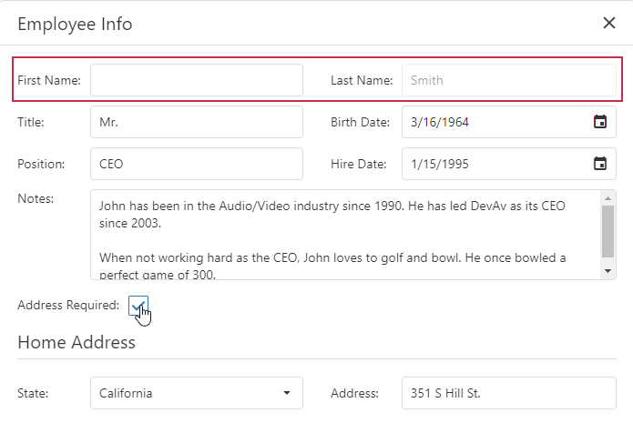

<!-- default badges list -->

<!-- default badges end -->

# DataGrid for DevExtreme - How to show/hide or enable/disable Edit Form items based on another item's value

This example demonstrates how to implement the following scenarios in DataGrid: 

- Hide the **Home Address** form item if the **AddressRequired** value is false.
- Disable the **LastName** item editor if the **FirstName** form item value is empty. 

## Implementation Details

- Define the [setCellValue](https://js.devexpress.com/Documentation/ApiReference/UI_Widgets/dxDataGrid/Configuration/columns/#setCellValue) callback function for the "AddressRequired" and "FirstName" columns to re-render items after an editor value is changed.
- Handle the [customizeItem](https://js.devexpress.com/Documentation/ApiReference/UI_Widgets/dxForm/Configuration/#customizeItem) form event.
-  In the event handler, call the [getRowIndexByKey](https://js.devexpress.com/Documentation/ApiReference/UI_Widgets/dxDataGrid/Methods/#getRowIndexByKeykey) and [cellValue](https://js.devexpress.com/Documentation/ApiReference/UI_Widgets/dxDataGrid/Methods/#cellValuerowIndex_dataField) methods to obtain current editor values. Assign the value obtained from the **cellValue** method to the item's [visible](https://js.devexpress.com/Documentation/ApiReference/UI_Widgets/dxForm/Item_Types/SimpleItem/#visible) property.

- In the [onEditorPreparing](https://js.devexpress.com/Documentation/ApiReference/UI_Widgets/dxDataGrid/Configuration/#onEditorPreparing) function, change the [disabled](https://js.devexpress.com/Documentation/ApiReference/UI_Widgets/dxTextBox/Configuration/#disabled) option of the required form item editor.

## Files to Review

- **jQuery**
    - [index.html](jQuery/index.html)
    - [index.js](jQuery/index.js)
- **Angular**
    - [app.component.html](Angular/src/app/app.component.html)
    - [app.component.ts](Angular/src/app/app.component.ts)
- **Vue**
    - [Home.vue](Vue/src/components/Home.vue)
- **React**
    - [App.js](React/src/App.js)
- **ASP.NET Core**    
    - [Index.cshtml](ASP.NET%20Core/Views/Home/Index.cshtml)

## Documentation

- [Getting Started with DataGrid](https://js.devexpress.com/Documentation/Guide/UI_Components/DataGrid/Getting_Started_with_DataGrid/)
- [DataGrid - API Reference](https://js.devexpress.com/Documentation/ApiReference/UI_Components/dxDataGrid/)
- [Form - API Reference](https://js.devexpress.com/Documentation/ApiReference/UI_Components/dxForm/)

## More Examples

- [DataGrid - How to implement a custom editing form using dxForm and dxPopup](https://github.com/DevExpress-Examples/DataGrid-How-to-implement-a-custom-editing-form-using-dxForm-and-dxPopup)
